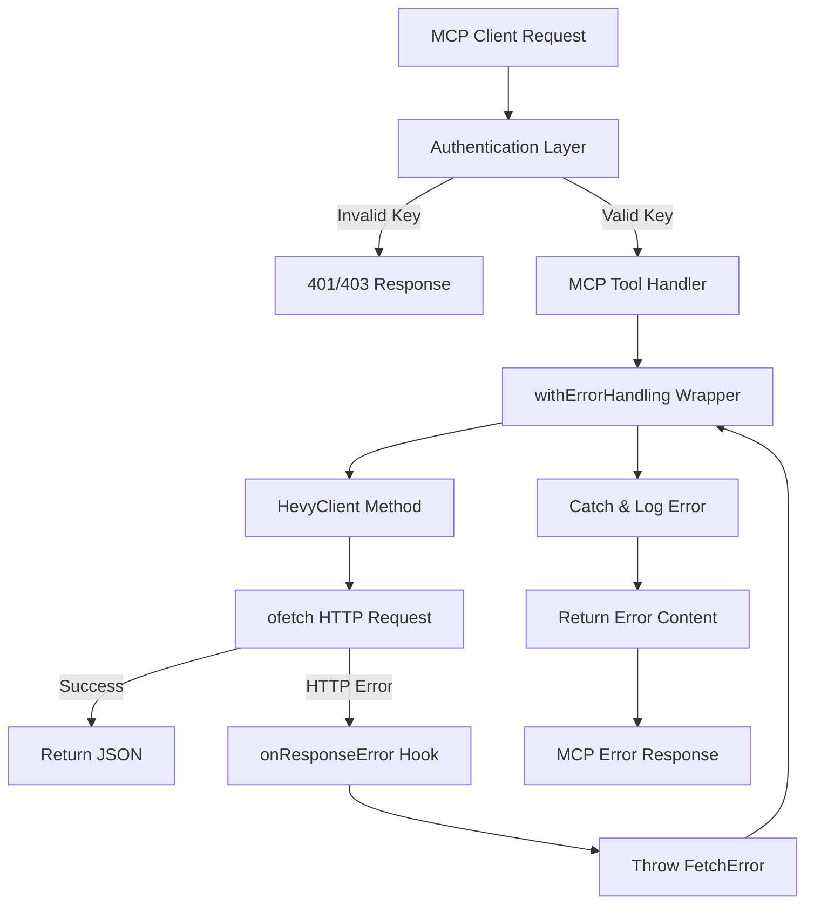

Hevy HTTP MCP uses a **layered error handling strategy** that separates concerns between HTTP errors, API errors, and MCP protocol errors. All errors are logged and converted to user-friendly MCP responses.

## Error Handling Layers



## Layer 1: Authentication Errors

Authentication happens **before** any MCP messages are processed. Invalid credentials result in immediate HTTP error responses:

```typescript
authentication: async (ctx) => {
  const authHeader =
    ctx.request.headers.get("Authorization") ??
    ctx.request.headers.get("authorization");

  if (!authHeader) {
    return {
      response: new Response(
        JSON.stringify({ error: "Missing Authorization header" }),
        { status: 401, headers: { "Content-Type": "application/json" } },
      ),
    };
  }

  const token = authHeader.startsWith("Bearer ")
    ? authHeader.slice(7)
    : authHeader;

  if (token !== config.mcpApiKey) {
    return {
      response: new Response(
        JSON.stringify({ error: "Invalid API key" }),
        { status: 403, headers: { "Content-Type": "application/json" } },
      ),
    };
  }

  return {
    authInfo: {
      token,
      clientId: "mcp-client",
      scopes: ["hevy:read", "hevy:write"],
    },
  };
}
```

<Note>
  Authentication errors **do not reach the tool handlers** — they're rejected at the HTTP transport layer. MCP clients receive a standard HTTP error response with JSON body.
</Note>

**Error responses:**

| Condition | Status | Response Body |
|-----------|--------|---------------|
| No `Authorization` header | 401 | `{ "error": "Missing Authorization header" }` |
| Invalid `MCP_API_KEY` | 403 | `{ "error": "Invalid API key" }` |

## Layer 2: HTTP Request Logging

The `HevyClient` uses `ofetch` interceptors to log all HTTP traffic:

### Request Logging

Every outgoing request is logged at `debug` level:

```typescript
onRequest: ({ request, options }) => {
  this.logger.debug(`[hevy] ${options.method ?? "GET"} ${String(request)}`);
}
```

**Example output:**
```
[2026-03-03T10:15:32.123Z] [DEBUG] [hevy] GET https://api.hevyapp.com/v1/workouts?page=1&pageSize=5
[2026-03-03T10:15:32.456Z] [DEBUG] [hevy] POST https://api.hevyapp.com/v1/workouts
```

### Error Response Logging

Failed requests (4xx/5xx) are logged at `error` level with the response body:

```typescript
onResponseError: ({ request, response }) => {
  this.logger.error(
    `[hevy] ${response.status} ${response.statusText} for ${String(request)}`,
    response._data,
  );
}
```

**Example output:**
```
[2026-03-03T10:15:32.789Z] [ERROR] [hevy] 404 Not Found for https://api.hevyapp.com/v1/workouts/invalid-id { error: 'Workout not found' }
[2026-03-03T10:15:33.012Z] [ERROR] [hevy] 500 Internal Server Error for https://api.hevyapp.com/v1/workouts { error: 'Database connection failed' }
```

<Info>
  The `onResponseError` hook **logs the error but doesn't catch it** — the promise still rejects with a `FetchError`. This allows calling code to handle different error types appropriately.
</Info>

## Layer 3: Tool Error Handling

All MCP tool handlers wrap their logic with `withErrorHandling()`, which catches errors and converts them to MCP-compatible responses.

### The `withErrorHandling` Wrapper

```typescript
/**
 * Wrap an async tool handler with consistent error handling.
 * Catches ofetch errors and returns a formatted error response
 * instead of crashing the MCP server.
 */
export function withErrorHandling(
  logger: Logger,
  toolName: string,
  handler: () => Promise<{ content: { type: "text"; text: string }[] }>,
) {
  return handler().catch((err: unknown) => {
    const fetchErr = err as FetchError | undefined;
    const status = fetchErr?.response?.status;
    const body = fetchErr?.data;

    const message =
      body && typeof body === "object" && "error" in body
        ? (body as { error: string }).error
        : fetchErr?.message ?? String(err);

    logger.error(`[${toolName}] Error${status ? ` (${status})` : ""}: ${message}`);

    return textContent(`Error: ${message}`);
  });
}
```

**What it does:**

1. **Executes the handler** — calls the provided async function
2. **Catches any error** — if the handler throws, catch it
3. **Extracts error message** — prioritizes:
   - Hevy API error message (`body.error`)
   - Fetch error message (`err.message`)
   - Generic string representation (`String(err)`)
4. **Logs the error** — includes tool name and HTTP status if available
5. **Returns MCP error content** — formatted as `{ content: [{ type: "text", text: "Error: ..." }] }`

### Usage in Tool Handlers

Every tool wraps its logic with `withErrorHandling()`:

```typescript
server.tool(
  "get-workout",
  "Get a single workout by its ID",
  {
    workoutId: z.string().describe("The workout ID"),
  },
  async (args) =>
    withErrorHandling(logger, "get-workout", async () => {
      const data = await client.getWorkout(args.workoutId);
      return jsonContent(data);
    }),
);
```

**Flow:**

1. MCP client calls `get-workout` with `{ workoutId: "invalid-id" }`
2. Handler calls `client.getWorkout("invalid-id")`
3. `ofetch` makes HTTP request to Hevy API
4. Hevy API returns `404 Not Found` with `{ error: "Workout not found" }`
5. `onResponseError` logs the error
6. `ofetch` throws `FetchError`
7. `withErrorHandling` catches it
8. Extracts `"Workout not found"` from response body
9. Logs `[get-workout] Error (404): Workout not found`
10. Returns MCP content: `{ content: [{ type: "text", text: "Error: Workout not found" }] }`

<Note>
  The MCP server **never crashes** from API errors. All errors are caught, logged, and converted to valid MCP responses that clients can display to users.
</Note>

## Error Types

### Hevy API Errors

The Hevy API returns errors in this format:

```typescript
interface HevyApiError {
  error: string;
}
```

**Common errors:**

| Status | Error Message | Cause |
|--------|---------------|-------|
| 400 | `Invalid request` | Malformed request body or query parameters |
| 401 | `Unauthorized` | Invalid or missing `HEVY_API_KEY` |
| 404 | `Workout not found` | Resource doesn't exist |
| 404 | `Routine not found` | Resource doesn't exist |
| 429 | `Rate limit exceeded` | Too many requests in a short period |
| 500 | `Internal server error` | Hevy API issue |

### Network Errors

If the Hevy API is unreachable, `ofetch` throws a network error:

```typescript
FetchError: fetch failed
```

**Example handling:**

```typescript
// Logged as:
[get-workouts] Error: fetch failed

// Returned to client as:
{ content: [{ type: "text", text: "Error: fetch failed" }] }
```

### Validation Errors

Zod schemas validate tool arguments **before** the handler executes. Invalid arguments are rejected by the MCP SDK before reaching `withErrorHandling()`.

**Example:**

```typescript
server.tool(
  "get-workouts",
  "Fetch a paginated list of workouts",
  {
    page: z.number().optional().describe("Page number (default: 1)"),
    pageSize: z.number().optional().describe("Items per page (default: 5, max: 10)"),
  },
  // ...
);
```

If a client sends `{ page: "invalid" }`, the MCP SDK returns a validation error without executing the handler.

## Logging Strategy

The application uses a **structured logger** with four levels:

```typescript
export type LogLevel = "debug" | "info" | "warn" | "error";

const LOG_LEVELS: Record<LogLevel, number> = {
  debug: 0,
  info: 1,
  warn: 2,
  error: 3,
};
```

### Log Levels

<Tabs>
  <Tab title="debug">
    **When to use:** HTTP requests, internal state changes, detailed flow tracing

    **Examples:**
    ```
    [2026-03-03T10:15:32.123Z] [DEBUG] [hevy] GET https://api.hevyapp.com/v1/workouts
    ```

    **Enable in development:**
    ```bash
    LOG_LEVEL=debug bun run dev
    ```
  </Tab>
  <Tab title="info">
    **When to use:** Server lifecycle events, tool registrations, successful operations

    **Examples:**
    ```
    [2026-03-03T10:15:30.000Z] [INFO] Starting hevy-http-mcp server…
    [2026-03-03T10:15:31.000Z] [INFO] All Hevy MCP tools registered
    [2026-03-03T10:15:31.500Z] [INFO] hevy-http-mcp listening on http://127.0.0.1:3000/mcp
    ```

    **Default level** in production.
  </Tab>
  <Tab title="warn">
    **When to use:** Recoverable issues, deprecated features, rate limit warnings

    **Examples:**
    ```
    [2026-03-03T10:15:32.456Z] [WARN] Rate limit approaching (90% of quota used)
    ```

    Currently **not used** in the codebase — reserved for future warnings.
  </Tab>
  <Tab title="error">
    **When to use:** Failed API requests, unhandled tool errors, configuration issues

    **Examples:**
    ```
    [2026-03-03T10:15:32.789Z] [ERROR] [hevy] 404 Not Found for https://api.hevyapp.com/v1/workouts/invalid-id { error: 'Workout not found' }
    [2026-03-03T10:15:33.012Z] [ERROR] [get-workout] Error (404): Workout not found
    [config] Missing required environment variable: HEVY_API_KEY
    ```

    These errors are **logged but handled** — the server continues running.
  </Tab>
</Tabs>

### Logger Implementation

```typescript
export function createLogger(minLevel: LogLevel = "info"): Logger {
  const threshold = LOG_LEVELS[minLevel];

  function log(level: LogLevel, message: string, ...args: unknown[]): void {
    if (LOG_LEVELS[level] < threshold) return;
    const timestamp = new Date().toISOString();
    const prefix = `[${timestamp}] [${level.toUpperCase()}]`;
    switch (level) {
      case "debug":
        console.debug(prefix, message, ...args);
        break;
      case "info":
        console.info(prefix, message, ...args);
        break;
      case "warn":
        console.warn(prefix, message, ...args);
        break;
      case "error":
        console.error(prefix, message, ...args);
        break;
    }
  }

  return {
    debug: (msg, ...args) => log("debug", msg, ...args),
    info: (msg, ...args) => log("info", msg, ...args),
    warn: (msg, ...args) => log("warn", msg, ...args),
    error: (msg, ...args) => log("error", msg, ...args),
  };
}
```

**Features:**

- **Threshold filtering** — messages below `minLevel` are suppressed
- **ISO 8601 timestamps** — consistent format across all logs
- **Variadic arguments** — supports multiple arguments like `console.log`
- **Native console methods** — uses appropriate `console.*` for each level

### Configuration

Set the log level via environment variable:

```bash
# .env
LOG_LEVEL=debug  # or info, warn, error
```

Loaded in `index.ts`:

```typescript
const logger = createLogger(
  (process.env["LOG_LEVEL"] as "debug" | "info" | "warn" | "error") ?? "info",
);
```

## Response Helpers

Two helper functions format MCP responses:

### `textContent(text)`

Returns plain text content:

```typescript
export function textContent(text: string) {
  return {
    content: [{ type: "text" as const, text }],
  };
}
```

**Usage:**
```typescript
return textContent("Error: Workout not found");
// → { content: [{ type: "text", text: "Error: Workout not found" }] }
```

### `jsonContent(data)`

Returns pretty-printed JSON content:

```typescript
export function jsonContent(data: unknown) {
  return textContent(JSON.stringify(data, null, 2));
}
```

**Usage:**
```typescript
const workout = await client.getWorkout(workoutId);
return jsonContent(workout);
// → { content: [{ type: "text", text: "{\n  \"id\": \"123\",\n  ..." }] }
```

<Info>
  MCP clients receive JSON as a **text string**, not a structured object. This is by design — the MCP protocol uses text content, and clients can parse it as needed.
</Info>

## Error Flow Example

Let's trace a complete error scenario:

**Scenario:** Client requests a workout that doesn't exist

```typescript
// 1. MCP client sends request
POST /mcp
Authorization: Bearer correct-mcp-key
{
  "method": "tools/call",
  "params": {
    "name": "get-workout",
    "arguments": { "workoutId": "nonexistent-id" }
  }
}

// 2. Authentication passes
// → Request proceeds to tool handler

// 3. Tool handler executes
async (args) =>
  withErrorHandling(logger, "get-workout", async () => {
    const data = await client.getWorkout(args.workoutId);
    return jsonContent(data);
  })

// 4. HevyClient makes HTTP request
[2026-03-03T10:15:32.123Z] [DEBUG] [hevy] GET https://api.hevyapp.com/v1/workouts/nonexistent-id

// 5. Hevy API returns 404
HTTP/1.1 404 Not Found
{ "error": "Workout not found" }

// 6. onResponseError logs the failure
[2026-03-03T10:15:32.456Z] [ERROR] [hevy] 404 Not Found for https://api.hevyapp.com/v1/workouts/nonexistent-id { error: 'Workout not found' }

// 7. ofetch throws FetchError
throw new FetchError("404 Not Found", { response, data })

// 8. withErrorHandling catches it
catch ((err: unknown) => {
  const message = err.data.error; // "Workout not found"
  logger.error(`[get-workout] Error (404): ${message}`);
  return textContent(`Error: ${message}`);
})

// 9. Additional error log
[2026-03-03T10:15:32.789Z] [ERROR] [get-workout] Error (404): Workout not found

// 10. MCP response returned to client
{
  "content": [
    { "type": "text", "text": "Error: Workout not found" }
  ]
}
```

**Key observations:**

- Error is logged **twice**: once by `onResponseError`, once by `withErrorHandling`
- The first log includes raw HTTP details, the second is tool-specific
- The server **never crashes** — a valid MCP response is always returned
- The client receives a user-friendly error message, not a stack trace

## Best Practices

### When Adding New Tools

1. **Always wrap handlers** with `withErrorHandling()`
2. **Use descriptive tool names** — they appear in error logs
3. **Validate early** — use Zod schemas to catch bad input before API calls
4. **Return `jsonContent()` on success** — consistent formatting

```typescript
server.tool(
  "create-workout",  // Descriptive name for error logs
  "Create a new workout",
  {
    workout: workoutInputSchema.describe("Workout data to create"),  // Zod validation
  },
  async (args) =>
    withErrorHandling(logger, "create-workout", async () => {  // Error wrapper
      const data = await client.createWorkout(args.workout);
      return jsonContent(data);  // Consistent response format
    }),
);
```

### When Debugging Errors

1. **Enable debug logging** — see all HTTP traffic:
   ```bash
   LOG_LEVEL=debug bun run dev
   ```

2. **Check both error logs** — `onResponseError` shows the raw API response, `withErrorHandling` shows the extracted message

3. **Test with MCP Inspector** — use `bun run inspect` to interactively test tools and see error responses

4. **Verify API key** — 401/403 errors often mean invalid `HEVY_API_KEY`

### When Handling Errors in Client Code

If you're calling `HevyClient` methods directly (not through MCP tools), handle errors explicitly:

```typescript
try {
  const workout = await hevy.getWorkout(workoutId);
  // Success path
} catch (err) {
  const fetchErr = err as FetchError;
  if (fetchErr.response?.status === 404) {
    // Resource not found — handle gracefully
    console.log("Workout not found");
  } else {
    // Unexpected error — log and re-throw
    logger.error("Failed to fetch workout:", err);
    throw err;
  }
}
```

<Note>
  The `HevyClient` **does not catch errors** — it's the caller's responsibility to handle them. This allows different callers to handle the same error differently (e.g., retry on 429, abort on 404).
</Note>
