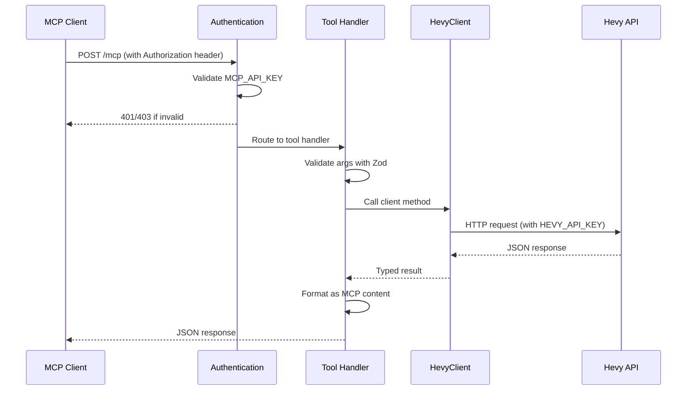

Hevy HTTP MCP is an HTTP-based Model Context Protocol server that exposes the Hevy workout tracker API to AI assistants and MCP-compatible clients. The architecture is designed for simplicity, type safety, and consistent error handling.

## Tech Stack

The project is built on modern TypeScript tooling optimized for performance and developer experience:

<Tabs>
  <Tab title="Elysia">
    **[Elysia](https://elysiajs.com/)** is a fast, end-to-end type-safe web framework built for Bun. It provides:
    - Lightning-fast HTTP server performance
    - Full TypeScript inference across routes and handlers
    - Plugin system for extending functionality
    - Native integration with Bun's runtime

    ```typescript
    const app = new Elysia()
      .use(mcp({ /* ... */ }))
      .listen({ port: config.port, hostname: config.host });
    ```
  </Tab>
  <Tab title="elysia-mcp">
    **[elysia-mcp](https://github.com/kerlos/elysia-mcp)** is an Elysia plugin that implements the Model Context Protocol specification. It handles:
    - MCP protocol handshake and message routing
    - Tool registration and schema validation
    - HTTP transport layer
    - Authentication middleware

    The plugin exposes a `setupServer` hook where tools are registered:

    ```typescript
    mcp({
      basePath: "/mcp",
      serverInfo: {
        name: "hevy-http-mcp",
        version: "1.0.0",
      },
      setupServer: (server) => {
        registerWorkoutTools(server, hevy, logger);
        registerRoutineTools(server, hevy, logger);
        // ...
      },
    })
    ```
  </Tab>
  <Tab title="ofetch">
    **[ofetch](https://github.com/unjs/ofetch)** is a better `fetch` API built on native Web Fetch. Features:
    - Auto-retry with exponential backoff
    - Request/response interceptors
    - JSON parsing by default
    - Type-safe response handling

    The `HevyClient` uses `ofetch.create()` to build a pre-configured client:

    ```typescript
    this.fetch = ofetch.create({
      baseURL: "https://api.hevyapp.com",
      headers: {
        "api-key": this.apiKey,
        Accept: "application/json",
      },
      onRequest: ({ request, options }) => {
        this.logger.debug(`[hevy] ${options.method ?? "GET"} ${String(request)}`);
      },
      onResponseError: ({ request, response }) => {
        this.logger.error(
          `[hevy] ${response.status} ${response.statusText} for ${String(request)}`,
          response._data,
        );
      },
    });
    ```
  </Tab>
  <Tab title="Bun">
    **[Bun](https://bun.sh/)** is an all-in-one JavaScript runtime and toolkit:
    - Fast startup and execution (3x faster than Node.js)
    - Native TypeScript support (no compilation step)
    - Built-in package manager and test runner
    - Compatible with Node.js APIs

    The entire project runs with a single command:

    ```bash
    bun run start
    ```
  </Tab>
</Tabs>

## Project Structure

The codebase follows a clean, layered architecture:

```
hevy-http-mcp/
├── .env.example          # Environment variable template
├── package.json
├── tsconfig.json
├── README.md
└── src/
    ├── index.ts           # Entry point — Elysia server + MCP plugin setup
    ├── config.ts          # Environment variable loading & validation
    ├── logger.ts          # Structured logger with levels
    ├── hevy/
    │   ├── index.ts       # Re-exports
    │   ├── client.ts      # Hevy API client (ofetch)
    │   └── types.ts       # TypeScript types for all Hevy API entities
    └── tools/
        ├── index.ts       # Re-exports all tool registrations
        ├── helpers.ts     # Shared MCP response builders + error wrapper
        ├── workouts.ts    # Workout tools
        ├── routines.ts    # Routine tools
        ├── templates.ts   # Exercise template tools
        └── folders.ts     # Routine folder tools
```

### Layer Responsibilities

<Info>
  The architecture follows a **dependency injection pattern**: the entry point creates instances of `Logger` and `HevyClient`, then passes them down to tool registration functions. This makes testing easier and keeps concerns separated.
</Info>

#### Entry Point (`index.ts`)

Bootstraps the application and wires up all dependencies:

```typescript
const config = loadConfig();
const logger = createLogger(
  (process.env["LOG_LEVEL"] as "debug" | "info" | "warn" | "error") ?? "info",
);
const hevy = new HevyClient(config.hevyApiKey, logger);

logger.info("Starting hevy-http-mcp server…");

const app = new Elysia()
  .use(
    mcp({
      basePath: "/mcp",
      serverInfo: {
        name: "hevy-http-mcp",
        version: "1.0.0",
      },
      capabilities: {
        tools: {},
      },
      enableLogging: true,
      authentication: async (ctx) => {
        const authHeader =
          ctx.request.headers.get("Authorization") ??
          ctx.request.headers.get("authorization");

        if (!authHeader) {
          return {
            response: new Response(
              JSON.stringify({ error: "Missing Authorization header" }),
              { status: 401, headers: { "Content-Type": "application/json" } },
            ),
          };
        }

        const token = authHeader.startsWith("Bearer ")
          ? authHeader.slice(7)
          : authHeader;

        if (token !== config.mcpApiKey) {
          return {
            response: new Response(
              JSON.stringify({ error: "Invalid API key" }),
              { status: 403, headers: { "Content-Type": "application/json" } },
            ),
          };
        }

        return {
          authInfo: {
            token,
            clientId: "mcp-client",
            scopes: ["hevy:read", "hevy:write"],
          },
        };
      },
      setupServer: (server) => {
        registerWorkoutTools(server, hevy, logger);
        registerRoutineTools(server, hevy, logger);
        registerTemplateTools(server, hevy, logger);
        registerFolderTools(server, hevy, logger);
        logger.info("All Hevy MCP tools registered");
      },
    }),
  )
  .listen({ port: config.port, hostname: config.host });

logger.info(`hevy-http-mcp listening on http://${config.host}:${config.port}/mcp`);
```

<Note>
  **Authentication is handled before any MCP messages are processed.** The `authentication` callback validates the `Authorization` header and returns either a rejection response or auth info that's attached to the MCP context.
</Note>

#### Configuration (`config.ts`)

Loads and validates environment variables with fail-fast behavior:

```typescript
export interface Config {
  /** Hevy API key for authenticating with the Hevy API */
  hevyApiKey: string;
  /** API key required by clients to access this MCP server */
  mcpApiKey: string;
  /** Port to run the server on */
  port: number;
  /** Hostname to bind to (default: 0.0.0.0) */
  host: string;
}

function requireEnv(name: string): string {
  const value = process.env[name];
  if (!value) {
    console.error(`[config] Missing required environment variable: ${name}`);
    process.exit(1);
  }
  return value;
}

export function loadConfig(): Config {
  return {
    hevyApiKey: requireEnv("HEVY_API_KEY"),
    mcpApiKey: requireEnv("MCP_API_KEY"),
    port: parseInt(process.env["PORT"] ?? "3000", 10),
    host: process.env["HOST"] ?? "127.0.0.1",
  };
}
```

#### Hevy Client Layer (`hevy/`)

Encapsulates all Hevy API communication. See [HevyClient](/architecture/hevy-client) for details.

#### Tools Layer (`tools/`)

Registers MCP tools using Zod schemas for validation. Each tool:
1. Validates input parameters with Zod
2. Calls the appropriate `HevyClient` method
3. Wraps the call with `withErrorHandling()` for consistent error responses
4. Returns JSON-formatted MCP content

Example from `workouts.ts`:

```typescript
server.tool(
  "get-workouts",
  "Fetch a paginated list of workouts",
  {
    page: z.number().optional().describe("Page number (default: 1)"),
    pageSize: z.number().optional().describe("Items per page (default: 5, max: 10)"),
  },
  async (args) =>
    withErrorHandling(logger, "get-workouts", async () => {
      const data = await client.getWorkouts(args.page, args.pageSize);
      return jsonContent(data);
    }),
);
```

## Data Flow

A typical MCP tool request flows through these layers:



<Note>
  **Two separate API keys are in play:**
  1. `MCP_API_KEY` — validates the MCP client connecting to this server
  2. `HEVY_API_KEY` — authenticates this server with the Hevy API

  The Hevy API key is never exposed to MCP clients.
</Note>

## Type Safety

The entire request/response chain is fully typed:

1. **API Types** (`hevy/types.ts`) — TypeScript interfaces for all Hevy API entities
2. **Client Methods** (`hevy/client.ts`) — Return typed promises based on API types
3. **Tool Schemas** (`tools/*.ts`) — Zod schemas infer runtime types
4. **MCP Responses** — Helpers ensure consistent response structure

This means:
- Invalid API responses are caught at runtime
- Tool arguments are validated before execution
- IDEs provide autocomplete for the entire API surface
- Refactoring is safe across the codebase

## Runtime Environment

The application runs as a single long-lived process:

```typescript
const app = new Elysia()
  .use(mcp({ /* ... */ }))
  .listen({ port: config.port, hostname: config.host });
```

- **Development**: `bun run dev` enables hot-reload on file changes
- **Production**: `bun run start` runs the compiled server
- **Inspection**: `bun run inspect` opens the MCP Inspector UI

No build step is required — Bun executes TypeScript directly.
